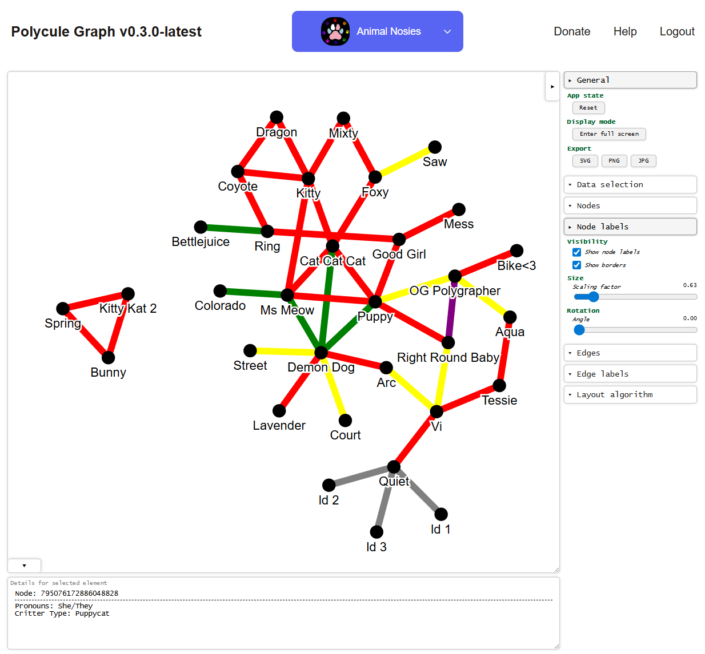

# Polycule Graph
A Discord bot for mapping out your polycule by allowing you to map relationships between users on your Discord server.

## Architecture
This project consists of a:
- Discord bot that users can interact with using slash commands: [bot.py](bot.py)
- NetworkX graph model for each polycule: [polycule.py](polycule.py)
- Web app [web.py](web.py) for
    - OAuth2 to Discord to see which guilds you can access
    - Displaying the graphs on a per server basis
- Reddis instance for server-side OAuth2 security

## Using
If you're just interested in using the project, there's a production instance [here](https://polyculegraph.mixty.pet). For guidance on how to invite the bot to your server and how to use the slash commands, see the [help portal](https://polyculegraph.mixty.pet/help)

## Self Hosting
If you wish to self host an instance, it's recommended to use `docker-compose`. The included [docker-compose.yml](docker-compose.yml) will build the project, startup the required services (reddis, bot, webapp), and expose the webapp at `localhost:5000`. You will need to provide a `.env` with the required API keys. See [keys.py](keys.py) for details.